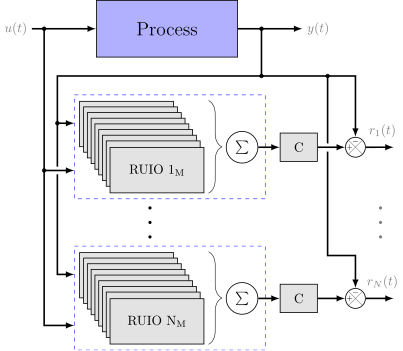
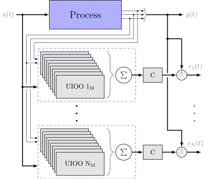

# Observer-based Fault Detection and Diagnostic (FDD)

## Abstract
This code presents the design of a fault detection and diagnosis (FDD) scheme, composed from a bank of two types of observers, applied to linear parameter varying (LPV) systems.

* The first one uses a combination of reduced-order LPV observers (LPV-RUIO) to detect, isolate and estimate actuators faults.

* The second one consists of a set of full-order LPV unknown input observers (LPV-UIOO) to detect, isolate and estimate sensors faults.

	

The observer's design, convergence and its stability conditions are guaranteed in terms of linear matrix inequalities (LMI). Therefore, the main purpose of this work is to provide a novelty model-based observers' technique to detect and diagnose faults upon non-linear systems.

Simulation results, based on two typical chemical industrial processes, are given to illustrate the implementation and performance of such approach.

## Requirements
- At least an i5-3337U CPU@2.7 GHz (2 Cores) with 6 GB of RAM.
- [Matlab software](https://mathworks.com/) R2016b or greater

### Packages:
- [Yalmip](https://yalmip.github.io/)
- [Gurobi](https://www.gurobi.com/)
- [SeDuMi](http://sedumi.ie.lehigh.edu/)
- LMI Lab

## Paper info
Emanuel Bernardi y Eduardo J. Adam. «Observer-based Fault Detection and Diagnosis Strategy for Industrial Processes». In: _Journal of the Franklin Institute_ 357 (14 2020), pp. 9895-9922. ISSN: 0016-0032. DOI: 10.1016/j.jfranklin.2020.07.046.

Send comments and questions to:

[Emanuel Bernardi](mailto:ebernardi@sanfrancisco.utn.edu.ar)
